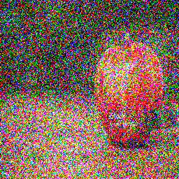
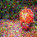
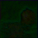

# 🚀 From Noise to Image

## Diffusion-Inspired AI Project

> Understanding diffusion models through simulation, CNN-based denoising, and modern AI tools.

---

## 📌 Project Overview

This project explores the core principles of **diffusion models**, one of the most powerful techniques in modern generative AI.

The goal is to understand how images are:

* progressively **corrupted with noise** (forward process)
* gradually **restored or generated** (reverse process)

This project includes:

* A **forward diffusion simulation**
* A **reverse-inspired denoising pipeline**
* A **CNN model** that learns to reconstruct clean images from noisy inputs
* A **Hugging Face diffusion demo**

---

## 🧠 Key Concepts

* Diffusion Models
* Gaussian Noise
* Image Denoising
* Convolutional Neural Networks (CNN)
* Generative AI

---

## ⚙️ Features

### 🔹 1. Forward Diffusion Simulation

A clean image is progressively corrupted using Gaussian noise.

Clean Image → Noisy Image → More Noise → Fully Corrupted

📂 Output:
outputs/forward_process/

---

### 🔹 2. Reverse Denoising Visualization

A basic denoising pipeline using classical image filters:

* Gaussian Blur
* Median Blur
* Bilateral Filter

This simulates the idea of reversing the diffusion process.

📂 Output:
outputs/reverse_process/

---

### 🔹 3. CNN-Based Image Denoising

A Convolutional Neural Network is trained to learn:

Noisy Image → Clean Image

Instead of using filters, the model learns patterns such as:

* edges
* textures
* color structures

📂 Output:
outputs/cnn_results/

Includes:

* Noisy input
* CNN output
* Ground truth image

---

### 🔹 4. Hugging Face Diffusion Demo

A pretrained diffusion model is used to generate images from noise using Hugging Face.

📂 Output:
outputs/hf_results/

---

## 🖼️ Results

### Forward Process

### Reverse Process

### CNN Denoising

| Noisy                                   | CNN Output                                 | Ground Truth                              |
| --------------------------------------- | ------------------------------------------ | ----------------------------------------- |
|  |  |  |

---

## 🛠️ Tech Stack

* Python
* NumPy
* OpenCV
* Matplotlib
* PyTorch
* Hugging Face (Diffusers)

---

## ▶️ How to Run

### 1. Clone repository

git clone https://github.com/yourusername/diffusion-project.git
cd diffusion-project

---

### 2. Create virtual environment

python -m venv venv
venv\Scripts\activate

---

### 3. Install dependencies

pip install -r requirements.txt

---

### 4. Run steps

#### Forward diffusion

python src/noise_simulation.py

#### Reverse denoising

python src/denoise_basic.py

#### CNN training

python src/train_cnn.py

#### Hugging Face demo

python src/huggingface_demo.py

---

## 📊 Project Structure

diffusion_project/
│
├── data/
│   └── apple.jpg
│
├── outputs/
│   ├── forward_process/
│   ├── reverse_process/
│   ├── cnn_results/
│   └── hf_results/
│
├── src/
│   ├── noise_simulation.py
│   ├── denoise_basic.py
│   ├── cnn_denoiser.py
│   ├── train_cnn.py
│   └── huggingface_demo.py
│
├── models/
├── requirements.txt
└── README.md

---

## 🎯 Learning Outcomes

Through this project, I gained hands-on understanding of:

* How diffusion models corrupt data step-by-step
* How reverse processes reconstruct images
* How CNNs learn image restoration tasks
* How modern generative AI models work

---

## 🚀 Future Improvements

* Train on larger datasets
* Implement real diffusion training (DDPM)
* Improve CNN architecture
* Add real-time denoising
* Combine with object detection (YOLO integration)

---

## 👤 Author

**Burak Kaygusuzoğlu**
Computer Engineering Student

---

⭐ If you like this project, consider giving it a star!
